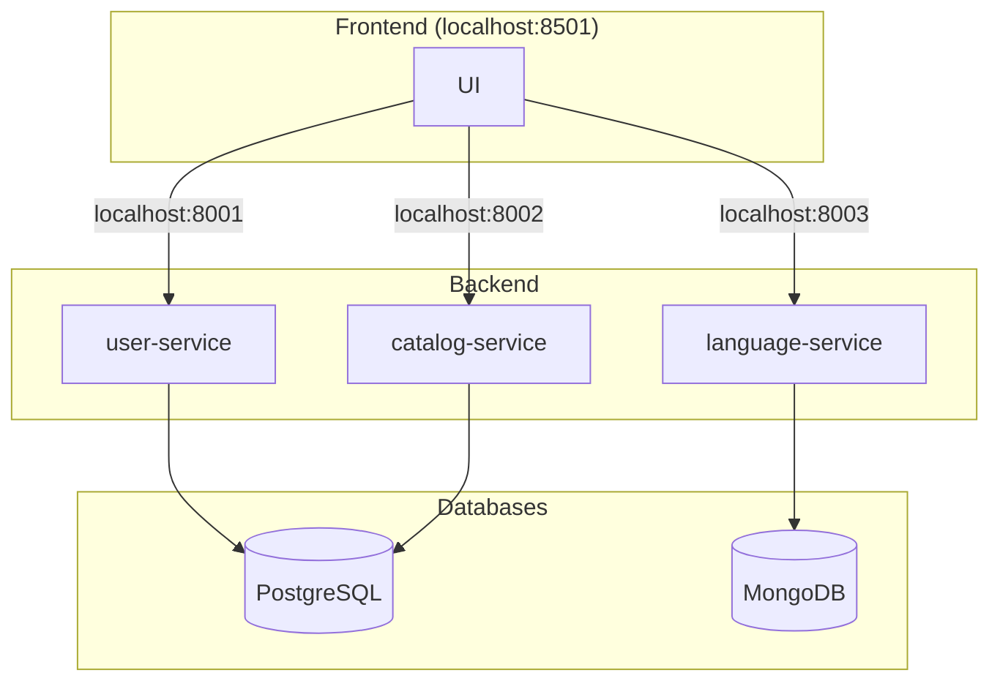

# Testing Sample App

This is a sample application designed as a testing sandbox. The application is built to allow creation, viewing, and deletion, implemented using **FastAPI** for the backend and **Streamlit** for the frontend.

## Features

## Application Architecture

The application is divided into backend microservices, frontend and databases:



### Backend

The backend consists of **FastAPI** microservices:
- **user-management**: Manages user authentication and CRUD operations for users.
- **catalog-management**: Manages CRUD operations for catalog items.
- **language-management**: Manages CRUD operations for language selection.

### Frontend

The frontend is a **Streamlit** application that communicates with the backend through API calls. It allows users to interact with the system.

### Databases

- **postgresql**: PostgreSQL database to store user information and language information.
- **mongodb**: MongoDB database to store catalog information.

### Features

- **User CRUD operations**: Create, read, update, and delete users / catalog items.
- **Permissions handling**: Each user has associated permissions which can be validated before performing certain actions in both the FE and the BE.
- **Internationalization**: The application can be used in `EN`, `ES`, `PT`, `FR` and `JP`.

## Running the Application

To run the application locally, you can use `docker-compose` to spin up all the necessary services. Make sure you have **Docker** and **Docker Compose** installed.

   ```pwsh
   Invoke-WebRequest "https://raw.githubusercontent.com/mg-diego/testing-sample-app/main/docker-compose.yml" -OutFile "docker-compose.yml"
   docker-compose up -d
   ```


