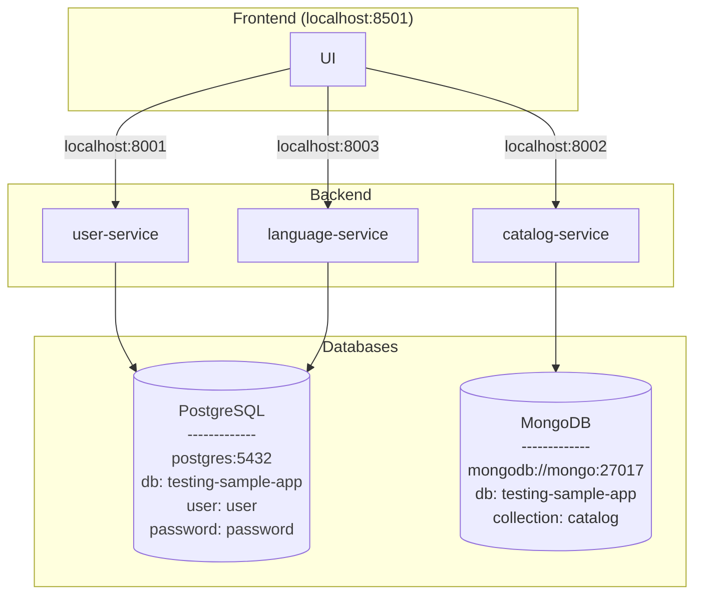

# 🕵️ Testing Sample App
[](https://www.docker.com/)
[](https://streamlit.io/)
[](https://fastapi.tiangolo.com/)
[](https://opensource.org/licenses/MIT)
[](#-language-support)

Welcome to the **Testing Sample App** — a lightweight sandbox designed for experimenting with test automation. This app is perfect for testing UI interactions, API flows, and multilingual interfaces, built with a modern stack:

- **Backend:** [FastAPI](https://fastapi.tiangolo.com/)

- **Frontend:** [Streamlit](https://streamlit.io/)


## 🚀 Quick Start

To run the application locally, you can use `docker-compose` to spin up all the necessary services. Make sure you have **Docker** and **Docker Compose** installed.

   ```pwsh
   Invoke-WebRequest "https://raw.githubusercontent.com/mg-diego/testing-sample-app/main/docker-compose.yml" -OutFile "docker-compose.yml"
   docker-compose up -d
   Start-Process "http://localhost:8501/?embed=True"
   ```

Once running, the app will open in your default browser.


## ✨ Key Features
### 🔐 Login
- Default credentials: `admin / admin`
- Error feedback on incorrect login

### 📦 Catalog Management
- **Create / Update** catalog items
  - Required: unique name & non-empty description
- **Delete** catalog entries
- **Filter** catalog by name

### 👥 User Management
- View list of users with sortable columns:
  - `Username`, `Password`, `Permissions`
- **Create** new users with:
  - Non-empty username/password
  - At least one permission
  - Unique username
- **Delete** users
  - Admin user (`admin`) and self-deletion are restricted

### 🌐 Language Support
- Instantly switch interface language:
  - `EN`, `ES`, `PT`, `FR` and `JP`.

## 🏗️ Application Architecture

The app follows a modular microservices design:



## ⚙️ Component Breakdown
### 🧠 Backend (FastAPI)
- `user-service`: Handles authentication, user creation, deletion, and permissions.

- `catalog-service`: Manages catalog item creation, update, and deletion.

- `language-service`: Enables dynamic UI translation settings.

### 🎨 Frontend (Streamlit)

- Renders UI components

- Communicates with the backend via REST APIs

- Enforces permission-based visibility and actions

### 💾 Databases

- **PostgreSQL:** Stores user credentials and language preferences.

- **MongoDB:** Stores catalog item data.


## 🌍 Internationalization
Easily switch between:

- 🇬🇧 English (EN)

- 🇪🇸 Spanish (ES)

- 🇵🇹 Portuguese (PT)

- 🇫🇷 French (FR)

- 🇯🇵 Japanese (JP)

This is fully supported across both frontend and backend services.

## 📬 Feedback & Contributions
This app is a sandbox environment for testing and learning. Contributions, suggestions, and issue reports are welcome!


